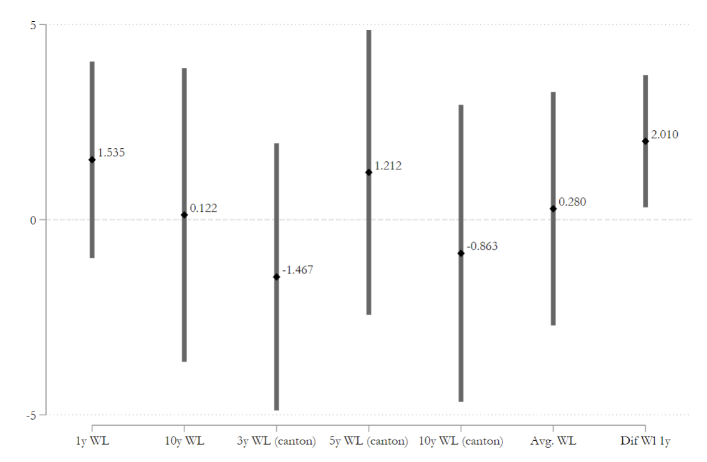
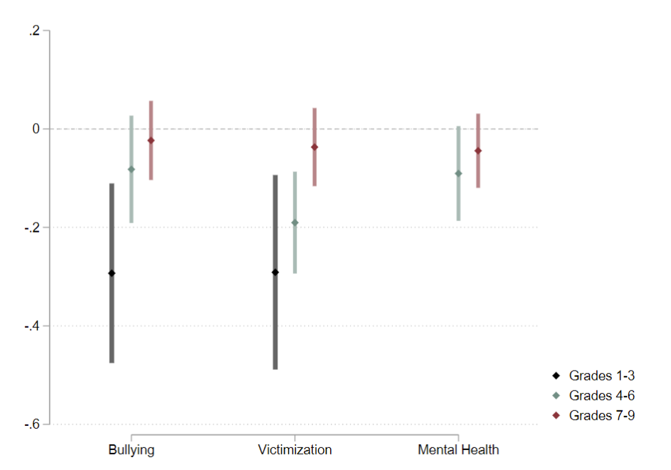
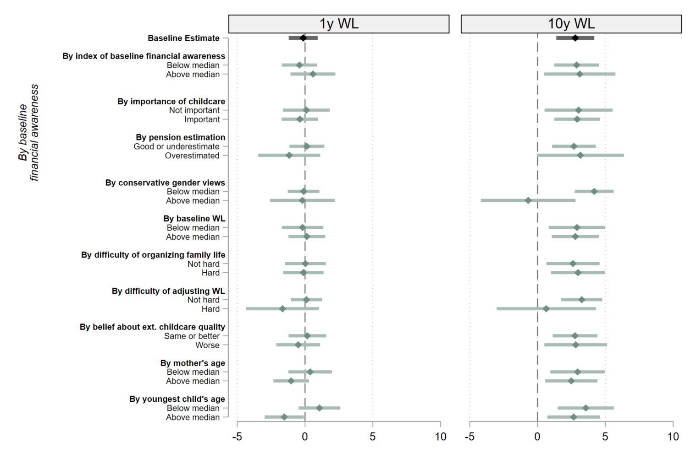

# REGRESSION 

## 📊 VISUALIZING REGRESSION OUTPUT

### COEFFICIENT PLOTS:
**Coefficient plots** are quick way to summarize regression outcome in a simpler way than a table, especially if you are comparing similar coefficients across samples or want to show how your main coefficients change due to different specifications. 

Most figures can be done with the [coefplot](http://repec.sowi.unibe.ch/stata/coefplot/getting-started.html) package (see examples below). Some useful things to know:
- **Graph aesthetics**: 
- **Combining coefplots**: 
  - Each coefplot has to be specified in a different subgraph (separated by ||)
  - If you need to add any design elements a specific subgraph, you need to use the [addplot](https://ideas.repec.org/c/boc/bocode/s457917.html) package and specify a `norescaling` option: ex. `addplot : , xline(0, lp(dash)) norescaling` adds a dashed line at $x=0$
  - To not have an ugly legend showing, specify `nokey`.
  - If you want all of the coefplots to appear in the same row, and you have more than two, add option `byopts(rows(1))`.

|   [Multiple outcomes side-by-side](../dofiles/coef_multoutcomes.do)    | [Multiple outcomes with diff specifications/subsamples](../dofiles/coef_multoutcomes_spe.do) |
| :--------------------------------------------------------------------: | :------------------------------------------------------------------------------------------: |
|  |                    |

|       [Heterogeneity analysis](../dofiles/coef_heterogeneity.do)       |
| :--------------------------------------------------------------------: |
|  |
|                                                                        |

### TABLES:

